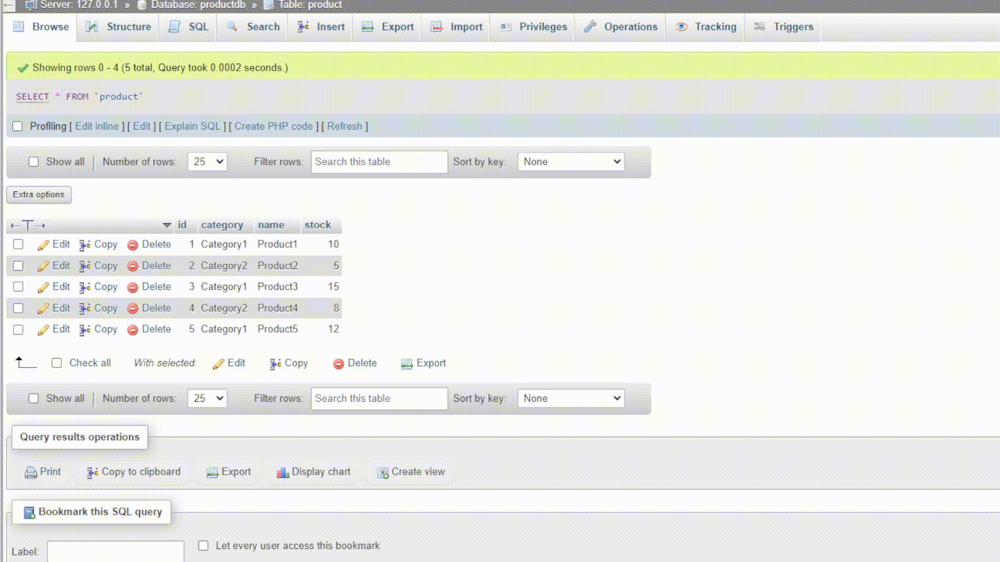

# Micro-Service de Recherche de Produits

Ce micro-service permet de rechercher les produits disponibles avec une quantité de stock supérieure à 0 dans une catégorie spécifiée par l'utilisateur.

## Exigences

- **Frameworks Backend**: Maven 3.x, Spring Boot 3.x, Spring Data, Spring REST
- **Frameworks Frontend**: React
- **Base de données**: MySQL
- **Docker-compose** pour la configuration de l'environnement de développement

## Astuces

### Backend

1. Créez l'application à l'aide de Maven.

2. Démarrez l'application et la base de données à l'aide de Docker Compose.

3. Accédez à l'application dans votre navigateur Web à l'adresse [http://localhost:8080](http://localhost:8080).

### Frontend

1. Accédez au répertoire « frontend ».

2. Installez les dépendances à l'aide de Yarn :

```bash
    yarn install
```

3. Démarrez le serveur de développement front-end :

```bash
    yarn start
```

4. Accédez à l'application dans votre navigateur Web à l'adresse [http://localhost:3000](http://localhost:3000).

## Demo
Voici une démo rapide de l'application en action :


